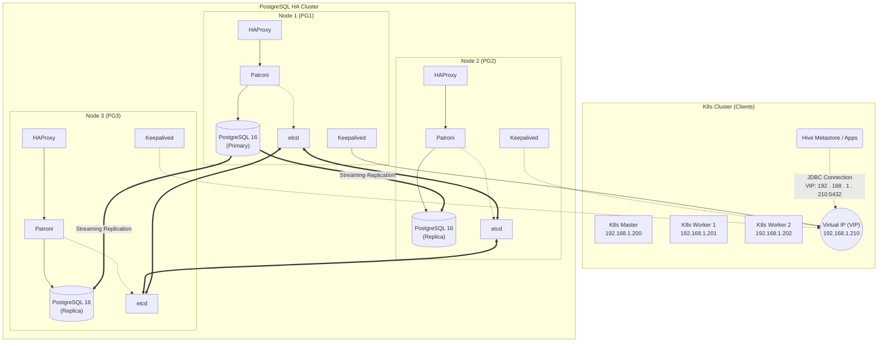
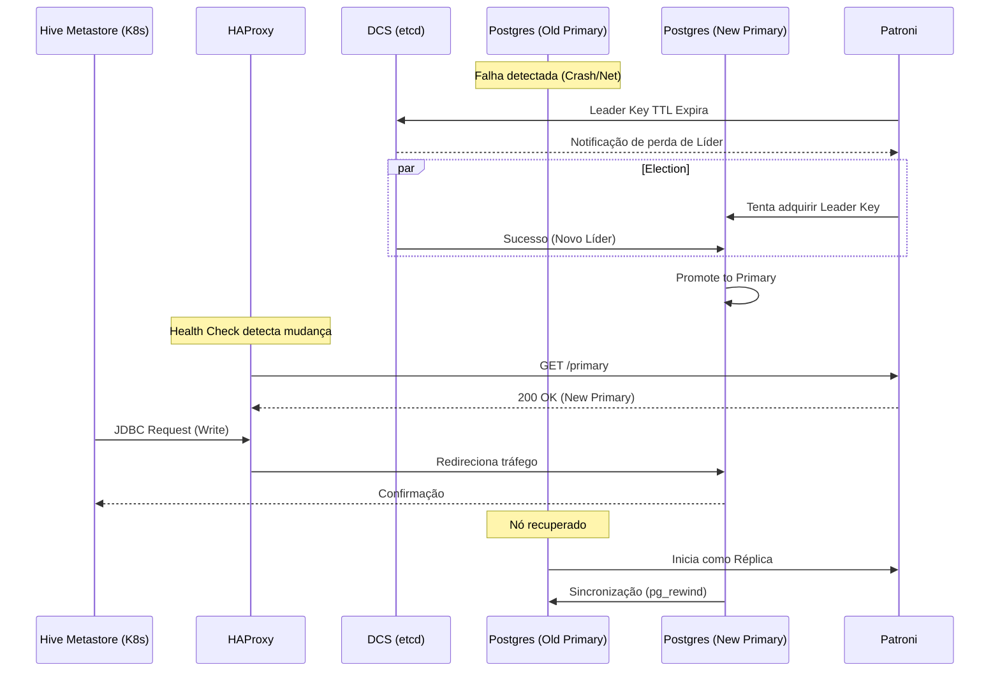

# Guia de Alta Disponibilidade PostgreSQL para Hive Metastore

Este documento detalha a arquitetura, implantação e operação de um cluster PostgreSQL de Alta Disponibilidade (HA) fora
do Kubernetes, servindo como backend robusto para o Hive Metastore e outras aplicações críticas.

## 1. Arquitetura e Design

### 1.1 Visão Geral da Infraestrutura

O ambiente é composto por:

* **Cluster Kubernetes (Client)**: 3 nós (Master + 2 Workers) executando o Hive Metastore.
* **Cluster PostgreSQL (Backend)**: 3 nós dedicados executando PostgreSQL 16, Patroni e etcd.
* **Load Balancing**: HAProxy + Keepalived em cada nó de banco (ou nós dedicados) provendo um IP Virtual (VIP) único.

### 1.2 Diagrama de Implantação (Deployment Diagram)

O diagrama abaixo ilustra a topologia física e lógica dos componentes.



### 1.3 Fluxo de Failover (Failover Sequence)

Diagrama de sequência demonstrando o comportamento do sistema em caso de falha do nó Primário (Leader).



## 2. Configuração Completa

Esta seção aborda a instalação e configuração de todos os componentes nos 3 nós de banco de dados (ex: `pg1`, `pg2`,
`pg3`).

### 2.1 Pré-requisitos do Sistema (Kernel Tuning)

Configurações de sysctl para otimizar o PostgreSQL e permitir o funcionamento do Keepalived (Non-local bind).

**Arquivo:** `/etc/sysctl.d/99-postgresql.conf`

```bash
# Permitir binding de IP não local (Essencial para Keepalived/VIP)
net.ipv4.ip_nonlocal_bind = 1

# Otimizações de Memória e Rede para PostgreSQL
vm.swappiness = 10
vm.dirty_background_ratio = 5
vm.dirty_ratio = 15
vm.overcommit_memory = 2
vm.overcommit_ratio = 90
net.core.somaxconn = 4096
net.ipv4.tcp_keepalive_time = 7200
net.ipv4.tcp_keepalive_probes = 9
net.ipv4.tcp_keepalive_intvl = 75
```

Aplicar mudanças:

```bash
sysctl -p /etc/sysctl.d/99-postgresql.conf
```

### 2.2 Instalação de Pacotes

Instalação do PostgreSQL 16, Patroni, etcd, HAProxy e Keepalived no OpenSUSE Leap 15.6.

```bash
# Adicionar repositórios (se necessário) e atualizar
zypper refresh && zypper update -y

# Instalar dependências e ferramentas
zypper install -y python3-pip python3-devel gcc gcc-c++ libpq5 libpq-devel git

# Instalar PostgreSQL 16 (Exemplo usando repositório oficial PG se disponível, ou padrão do sistema)
# Nota: Verifique se o repo pgda-16 está habilitado para SUSE
zypper install -y postgresql16-server postgresql16-contrib postgresql16-docs

# Instalar Patroni e dependências do etcd via pip (recomendado para versões mais recentes)
pip install patroni[etcd] psycopg2-binary

# Instalar etcd (DCS), HAProxy e Keepalived
zypper install -y etcd haproxy keepalived watchdog
```

### 2.3 Configuração do etcd

Configure o cluster etcd nos 3 nós. Exemplo de configuração para o **Node 1** (`192.168.1.200`). Ajuste IPs para os
outros nós.

**Arquivo:** `/etc/etcd/etcd.conf.yml`

```yaml
name: 'pg1'
data-dir: '/var/lib/etcd/default.etcd'
listen-peer-urls: 'http://192.168.1.200:2380'
listen-client-urls: 'http://192.168.1.200:2379,http://127.0.0.1:2379'
initial-advertise-peer-urls: 'http://192.168.1.200:2380'
advertise-client-urls: 'http://192.168.1.200:2379'
initial-cluster: 'pg1=http://192.168.1.200:2380,pg2=http://192.168.1.201:2380,pg3=http://192.168.1.202:2380'
initial-cluster-token: 'etcd-cluster-01'
initial-cluster-state: 'new'
```

### 2.4 Configuração do Patroni

O Patroni gerencia o PostgreSQL. Crie o arquivo YAML.

**Arquivo:** `/etc/patroni/patroni.yml`

```yaml
scope: postgres-ha-cluster
namespace: /db/
name: pg1 # Alterar para pg2, pg3 nos respectivos nós

restapi:
  listen: 192.168.1.200:8008 # IP do nó
  connect_address: 192.168.1.200:8008

etcd:
  hosts:
    - 192.168.1.200:2379
    - 192.168.1.201:2379
    - 192.168.1.202:2379

bootstrap:
  dcs:
    ttl: 30
    loop_wait: 10
    retry_timeout: 10
    maximum_lag_on_failover: 1048576
    postgresql:
      use_pg_rewind: true
      use_slots: true
      parameters:
        wal_level: replica
        hot_standby: "on"
        wal_keep_segments: 8
        max_wal_senders: 10
        max_replication_slots: 10
        wal_log_hints: "on"
        archive_mode: "on"
        archive_command: "mkdir -p /var/lib/pgsql/wal_archive && cp %p /var/lib/pgsql/wal_archive/%f"
        logging_collector: "on"
        log_destination: "csvlog"
        log_directory: "pg_log"
        log_filename: "postgresql-%Y-%m-%d_%H%M%S.log"
        max_connections: 500

  initdb:
    - encoding: UTF8
    - data-checksums

postgresql:
  listen: 192.168.1.200:5432
  connect_address: 192.168.1.200:5432
  data_dir: /var/lib/pgsql/data
  bin_dir: /usr/lib/postgresql16/bin
  pgpass: /tmp/pgpass
  authentication:
    replication:
      username: replicator
      password: "c9n549l3."
    superuser:
      username: postgres
      password: "c9n549l3."
    rewind:
      username: rewind
      password: "c9n549l3."
  parameters:
    unix_socket_directories: '.'

tags:
  nofailover: false
  noloadbalance: false
  clonefrom: false
  nosync: false

> [!IMPORTANT]
> **Configuração por Nó**: Este arquivo deve ser criado em **TODOS** os nós do cluster PostgreSQL (PG1, PG2, PG3). No entanto, você deve alterar as seguintes chaves para corresponder ao IP e nome de cada servidor específico:
> *   `name`: `pg1`, `pg2`, ou `pg3`
> *   `restapi.listen` e `restapi.connect_address`: IP do próprio nó.
> *   `postgresql.listen` e `postgresql.connect_address`: IP do próprio nó.
> *   `etcd.hosts`: Deve listar os IPs de todos os nós onde o etcd está rodando.

```

### 2.5 Configuração do HAProxy

O HAProxy encaminhará o tráfego apenas para o nó **Primary** (Leader) consultando a API do Patroni.

**Arquivo:** `/etc/haproxy/haproxy.cfg`

```cfg
global
    maxconn 1000
    log /dev/log local0

defaults
    log global
    mode tcp
    retries 2
    timeout client 30m
    timeout connect 4s
    timeout server 30m
    timeout check 5s

listen postgres_write
    bind *:5432
    option httpchk GET /primary
    http-check expect status 200
    default-server inter 3s fall 3 rise 2 on-marked-down shutdown-sessions
    server pg1 192.168.1.200:5432 maxconn 100 check port 8008
    server pg2 192.168.1.201:5432 maxconn 100 check port 8008
    server pg3 192.168.1.202:5432 maxconn 100 check port 8008

# Interface de Estatísticas (Opcional, para monitoramento)
listen stats
    bind *:7000
    stats enable
    stats uri /
    stats refresh 5s

> [!NOTE]
> **Configuração Idêntica**: Ao contrário do Patroni e Keepalived, o arquivo `haproxy.cfg` é **IDÊNTICO** em todos os nós do cluster. Ele deve listar todos os servidores de backend conforme o exemplo acima.

```

### 2.6 Configuração do Keepalived (VIP)

Garante que o VIP `192.168.1.210` esteja sempre disponível em um dos nós ativos.

**Arquivo:** `/etc/keepalived/keepalived.conf`

```conf
vrrp_script chk_haproxy {
    script "killall -0 haproxy" # Verifica se o processo HAProxy está rodando
    interval 2
    weight 2
}

vrrp_instance VI_1 {
    interface eth0          # AJUSTAR para a interface de rede correta (ex: eth0, em1)
    state MASTER            # PG1 = MASTER, Outros = BACKUP
    virtual_router_id 51
    priority 101            # PG1=101, PG2=100, PG3=99 (prioridade decrescente)
    advert_int 1
    
    authentication {
        auth_type PASS
        auth_pass secret_vip_pass
    }
    
    unicast_src_ip 192.168.1.200 # IP deste nó
    unicast_peer {
        192.168.1.201
        192.168.1.202
    }

    virtual_ipaddress {
        192.168.1.210/24
    }
    
    track_script {
        chk_haproxy
    }
}

> [!IMPORTANT]
> **Configuração por Nó**: Este arquivo deve estar presente em **TODOS** os nós, mas com ajustes:
> *   `state`: O nó principal (ex: pg1) deve ser `MASTER`, os outros `BACKUP`.
> *   `priority`: Deve ser decrescente (ex: pg1=101, pg2=100, pg3=99).
> *   `unicast_src_ip`: IP da própria máquina.
> *   `unicast_peer`: Lista dos IPs dos **outros** nós.

```

## 3. Integração com Hive Metastore

Acesse o nó **Primary** (identificado via Patroni ou conectando pelo VIP) para criar o banco de dados do Metastore.

### 3.1 Inicialização do Banco de Dados

```bash
# Conectar no VIP (solicita senha do usuário 'postgres' configurada no patroni.yml)
psql -h 192.168.1.210 -p 5432 -U postgres

# SQL Comandos
CREATE DATABASE metastore;
CREATE USER hive WITH PASSWORD 'hive_password_secure';
GRANT ALL PRIVILEGES ON DATABASE metastore TO hive;

# (Opcional) Inicializar Schema se estiver rodando o schematool manualmente
# /opt/hive/bin/schematool -dbType postgres -initSchema
```

### 3.2 Configuração do Cliente (K8s/Hive)

No cluster Kubernetes ou nos nós que rodam o Hive, configure os arquivos XML para apontar para o VIP.

**Arquivo:** `hive-site.xml`

```xml

<configuration>
    <property>
        <name>javax.jdo.option.ConnectionURL</name>
        <value>jdbc:postgresql://192.168.1.210:5432/metastore?ssl=false</value>
        <description>Conexão JDBC apontando para o VIP do cluster HA</description>
    </property>

    <property>
        <name>javax.jdo.option.ConnectionDriverName</name>
        <value>org.postgresql.Driver</value>
    </property>

    <property>
        <name>javax.jdo.option.ConnectionUserName</name>
        <value>hive</value>
    </property>

    <property>
        <name>javax.jdo.option.ConnectionPassword</name>
        <value>hive_password_secure</value>
    </property>
</configuration>
```

**Arquivo:** `core-site.xml`

Certifique-se de que o driver JDBC do PostgreSQL (`postgresql-42.x.x.jar`) esteja presente no classpath do Hive (
`$HIVE_HOME/lib` ou na imagem Docker).

## 4. Automação da Instalação

Crie o script `setup_postgres_ha.sh` para agilizar a configuração inicial dos nós.

```bash
#!/bin/bash
# setup_postgres_ha.sh
# Executar como root em OpenSUSE Leap 15.6

echo ">>> Configurando Kernel Tuning..."
cat <<EOF > /etc/sysctl.d/99-postgresql.conf
net.ipv4.ip_nonlocal_bind = 1
vm.swappiness = 10
EOF
sysctl -p /etc/sysctl.d/99-postgresql.conf

echo ">>> Instalando Pacotes Base..."
zypper refresh
zypper install -y python3-pip python3-devel gcc libpq5 libpq-devel git etcd haproxy keepalived watchdog
# Nota: Ajustar nome do pacote PG conforme repositório disponível
zypper install -y postgresql16-server 

echo ">>> Instalando Patroni..."
pip install patroni[etcd] psycopg2-binary

echo ">>> Criando diretórios..."
mkdir -p /var/lib/pgsql/data
mkdir -p /etc/patroni
chown -R postgres:postgres /var/lib/pgsql

echo ">>> Configuração base concluída. Edite /etc/patroni/patroni.yml e inicie os serviços."
```

## 5. Procedimentos de Teste e Operação

### 5.1 Teste de Failover Manual

Para testar a alta disponibilidade, simule a falha do nó líder.

1. **Identifique o Líder**:

    ```bash
    curl http://192.168.1.210:8008/cluster | jq .
    # Ou via patronictl
    patronictl -c /etc/patroni/patroni.yml list
    ```

2. **Force o Failover (Manual Switchover)**:

    ```bash
    patronictl -c /etc/patroni/patroni.yml switchover
    # Selecione o novo líder quando solicitado
    ```

3. **Simule Falha Abrupta (Crash)**:
   No nó Líder atual:

    ```bash
    systemctl stop patroni
    # O cluster deve eleger um novo líder em ~10-30 segundos.
    ```

### 5.2 Verificação de Replicação

Insira dados no VIP e verifique se eles aparecem nas réplicas.

1. **Inserir (VIP)**:

    ```bash
    psql -h 192.168.1.210 -U postgres -c "CREATE TABLE teste_ha (id serial, dt timestamp);"
    psql -h 192.168.1.210 -U postgres -c "INSERT INTO teste_ha (dt) VALUES (now());"
    ```

2. **Ler (Réplica Específica - ex: PG2 192.168.1.201)**:

    ```bash
    psql -h 192.168.1.201 -U postgres -c "SELECT * FROM teste_ha;"
    ```

## 6. Conclusão

Esta arquitetura garante que o Hive Metastore tenha um backend resiliente. O uso de **Patroni + etcd** previne "
split-brain", enquanto **HAProxy + Keepalived** fornece um endpoint transparente (`192.168.1.210`) para os clientes em
Kubernetes, eliminando a necessidade de reconfigurar JDBC URLs em caso de falha.
